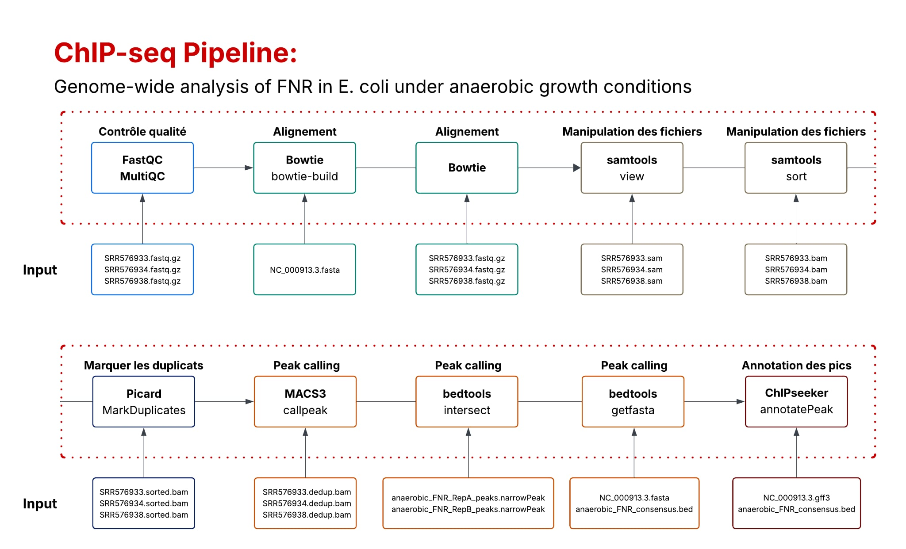
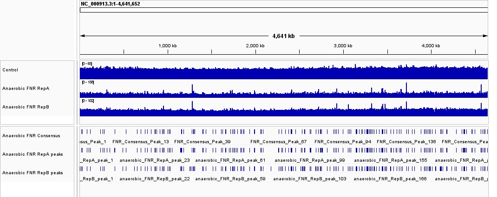

```{=html}
<style type="text/css">

.tocify-header {
  text-indent: initial;
}

.tocify-subheader > .tocify-item {
  text-indent: initial;
  padding-left: 2em;
}

#TOC{
  padding:5px;
#  transform: translateY(50%);
}


body{ 
    font-family: "Computer Modern Serif", serif;
    font-size: 16px;
    color: black;
}

h1.title {
  font-size: 36px;
  text-align: center;
}

h4.subtitle {
  text-align: center;
  color: black;
}

h4.author {
  text-align: center;
  color: black;
}

h4.date {
  text-align: center;
   color: black;
}
  
h1 { /* Header 1 */
  font-size: 24px;
}

h2 { /* Header 2 */
    font-size: 20px;
}

h3 { /* Header 3 */
  font-size: 18px;
}

</style>
```

```{r setup, include=FALSE}
knitr::opts_chunk$set(echo = TRUE)
```

# Aperçu de la pipeline d'analyse ChIP-seq  

```{r pipeline, fig.align="center", fig.show="hold", fig.cap="Pipeline ChIP-seq de l'analyse entreprise", echo=FALSE, out.width='100%'}

```

# Créer les dossiers

```{r, results='hide', warning=FALSE}
# Create the data folder
dir.create("data", showWarnings = FALSE, recursive = TRUE)

# Create the results folder and all sub-folders at once
dir.create("results/fastqc", showWarnings = FALSE, recursive = TRUE)
dir.create("results/multiqc", showWarnings = FALSE, recursive = TRUE)
dir.create("results/macs", showWarnings = FALSE, recursive = TRUE)
dir.create("results/bowtie", showWarnings = FALSE, recursive = TRUE)
dir.create("results/bedtools", showWarnings = FALSE, recursive = TRUE)
dir.create("results/picard", showWarnings = FALSE, recursive = TRUE)
dir.create("results/bigwig", showWarnings = FALSE, recursive = TRUE)

```

# Télécharger les données

## Réplicat biologique 1 (FNR IP ChIP-seq Anaerobique A)

```{r, results='hide',warning=FALSE}
if (!file.exists("data/SRR576933.fastq.gz")) {
  download.file(
    url = "https://ftp.sra.ebi.ac.uk/vol1/fastq/SRR576/SRR576933/SRR576933.fastq.gz",
  destfile = "data/SRR576933.fastq.gz",
  method = "wget",
  mode = "wb"
  )
}
```

## Réplicat biologique 2 (FNR IP ChIP-seq Anaerobique B)

```{r, results='hide',warning=FALSE}
if (!file.exists("data/SRR576934.fastq.gz")) {
  download.file(
    url = "https://ftp.sra.ebi.ac.uk/vol1/fastq/SRR576/SRR576934/SRR576934.fastq.gz",
    destfile = "data/SRR576934.fastq.gz",
    method = "wget",
    mode = "wb"
  )
}
```

## Contrôle (anaerobique INPUT DNA)

```{r, results='hide',warning=FALSE,message=FALSE}

if (!file.exists("data/SRR576938.fastq.gz")) {
  download.file(
    url = "https://ftp.sra.ebi.ac.uk/vol1/fastq/SRR576/SRR576938/SRR576938.fastq.gz",
    destfile = "data/SRR576938.fastq.gz",
    method = "wget", 
    extra = "-nc"   
  )
}
```

## Escherichia coli str. K-12 substr. MG1655, génome complet (NC_000913.3)

```{r, results='hide',warning=FALSE}
if (!file.exists("data/NC_000913.3.fasta")) {
  download.file(
    url = "https://eutils.ncbi.nlm.nih.gov/entrez/eutils/efetch.fcgi?db=nuccore&id=NC_000913.3&rettype=fasta&retmode=text", 
    destfile = "data/NC_000913.3.fasta", 
    method = "libcurl"
    )
}
```

## Escherichia coli str. K-12 substr. MG1655, génome annoté (NC_000913.3) 

```{r warning=FALSE, cache=FALSE, include=FALSE}
library(R.utils)
```

```{r, results='hide',warning=FALSE}
if (!file.exists("data/NC_000913.3.gff3")) {
  download.file(
    url = "https://ftp.ncbi.nlm.nih.gov/genomes/all/GCF/000/005/845/GCF_000005845.2_ASM584v2/GCF_000005845.2_ASM584v2_genomic.gff.gz",
    destfile = "data/NC_000913.3.gff3.gz",
    method = "wget",
    mode = "wb"
  )
  gunzip("data/NC_000913.3.gff3.gz")
}
```

# QC des reads avec FastQC

## Réplicat biologique 1

```{bash, results='hide'}
#!/bin/bash
fastqc --outdir \
results/fastqc data/SRR576933.fastq.gz &> data/fastqc_SRR576933.sh.log
```

## Réplicat biologique 2

```{bash, results='hide'}
fastqc --outdir \
results/fastqc data/SRR576934.fastq.gz &> data/fastqc_SRR576934.sh.log
```

## Contrôle

```{bash, results='hide'}
fastqc --outdir \
results/fastqc data/SRR576938.fastq.gz &> data/fastqc_SRR576938.sh.log
```

## MultiQC

```{bash, results='hide'}
multiqc --outdir results/multiqc results/fastqc/ 
```

# Alignement avec Bowtie

## Build index with bowtie-build

```{bash, results='hide'}
bowtie-build data/NC_000913.3.fasta results/bowtie/NC_000913.3
```

# Experiment rep 1 (trim last base)

```{bash, results='hide'}
zcat data/SRR576933.fastq.gz | \
bowtie results/bowtie/NC_000913.3 \
-q - -v 2 -m 1 -3 1 -S \
2> results/bowtie/SRR576933.out \
> results/bowtie/SRR576933.sam
```

# Experiment rep 2 (no trim of base)

```{bash, results='hide'}
zcat data/SRR576934.fastq.gz | \
bowtie results/bowtie/NC_000913.3 \
-q - -v 2 -m 1 -S \
2> results/bowtie/SRR576934.out \
> results/bowtie/SRR576934.sam
```

# Control (trim last base)

```{bash, results='hide'}
zcat data/SRR576938.fastq.gz | \
bowtie results/bowtie/NC_000913.3 \
-q - -v 2 -m 1 -3 1 -S \
2> results/bowtie/SRR576938.out \
> results/bowtie/SRR576938.sam
```

# Remove duplicates with PICARD

## Create sorted bams with samtools

```{bash, results='hide'}
samtools view -b results/bowtie/SRR576933.sam > results/bowtie/SRR576933.bam
samtools view -b results/bowtie/SRR576934.sam > results/bowtie/SRR576934.bam
samtools view -b results/bowtie/SRR576938.sam > results/bowtie/SRR576938.bam

samtools sort -o results/bowtie/SRR576933.sorted.bam results/bowtie/SRR576933.bam
samtools sort -o results/bowtie/SRR576934.sorted.bam results/bowtie/SRR576934.bam
samtools sort -o results/bowtie/SRR576938.sorted.bam results/bowtie/SRR576938.bam
```

## Mark and remove duplicates

```{bash, results='hide'}
SAMPLES=("SRR576933" "SRR576934" "SRR576938")

for ID in "${SAMPLES[@]}"; do
    picard MarkDuplicates \
          I=results/bowtie/${ID}.sorted.bam \
          O=results/picard/${ID}.dedup.bam \
          M=results/picard/${ID}.metrics.txt \
          REMOVE_DUPLICATES=true
done
```

```{bash}
grep "PERCENT_DUPLICATION" -A 1 results/picard/*.metrics.txt
```

# Peak calling with MACS3

## Rep A against control

```{bash, results='hide'}
macs3 callpeak \
-t results/picard/SRR576933.dedup.bam \
-c results/picard/SRR576938.dedup.bam \
-f BAM \
-g 4639675 \
-n anaerobic_FNR_RepA \
--outdir results/macs \
--bw 400 \
--keep-dup 1 \
--bdg \
--nomodel \
--SPMR \
&> results/macs/macs_RepA.out
```

## Rep B against control

```{bash, results='hide'}
macs3 callpeak \
-t results/picard/SRR576934.dedup.bam \
-c results/picard/SRR576938.dedup.bam \
-f BAM \
-g 4639675 \
-n anaerobic_FNR_RepB \
--outdir results/macs \
--bw 400 \
--keep-dup 1 \
--bdg \
--nomodel \
--SPMR \
&> results/macs/macs_RepB.out
```

## peak consensus with bedtools

```{bash,results='hide'}
bedtools intersect \
  -a results/macs/anaerobic_FNR_RepA_peaks.narrowPeak \
  -b results/macs/anaerobic_FNR_RepB_peaks.narrowPeak \
  | awk 'BEGIN{OFS="\t"} {$4="FNR_Consensus_Peak_"NR; print $0}' \
  > results/bedtools/anaerobic_FNR_consensus.bed
```

## Extract fasta sequences

```{bash,results='hide'}
bedtools getfasta \
  -fi data/NC_000913.3.fasta \
  -bed results/bedtools/anaerobic_FNR_consensus.bed \
  -fo results/bedtools/anaerobic_FNR_consensus.fasta
```

## View peaks using IGV

```{r igv, fig.align="center", fig.show="hold", fig.cap="IGV tracks", echo=FALSE, out.width='100%'}

```

# Annotation des pics avec ChIPseeker

## Découverte de motifs avec MEME/STREME et RSAT

## ChIPseeker

```{r, message=FALSE, warning=FALSE, results='hide'}
library(ChIPseeker)
library(txdbmaker)

# Création du transcript database 
txdb <- makeTxDbFromGFF("data/NC_000913.3.gff3")

# Télécharger les pics de consensus
peaks <- readPeakFile("results/bedtools/anaerobic_FNR_consensus.bed")
head(peaks)
# Annotation des pics
peakAnno <- annotatePeak(peaks, 
                         tssRegion = c(-250, 50), 
                         TxDb = txdb)

df_peakAnno <- as.data.frame(peakAnno) 
```

```{r, echo=FALSE, cache=FALSE, warning=FALSE}
library(DT)
```

```{r table1}
datatable(df_peakAnno,
          caption="Annotation")
head(df_peakAnno)
```  
   
     
```{r piechart, fig.align="center", fig.show="hold", fig.cap="pie", out.width='100%'}
plotAnnoPie(peakAnno,
            main="Pie chart")
```  
  

```{r topPeaks}
top_10_peaks <- df_peakAnno[order(-df_peakAnno$V9), ][1:10, ] 

report_table <- top_10_peaks[, c("seqnames", "start", "end", "V9", "annotation", "geneId", 'transcriptId')]
colnames(report_table) <- c("Chr", "Début", "Fin", "q-valeur", "Annotation", "Gene ID", 'Transcrit ID')

knitr::kable(report_table, caption = "Top 10 des sites de liaisons de FNR selon la q-valeur")
```
